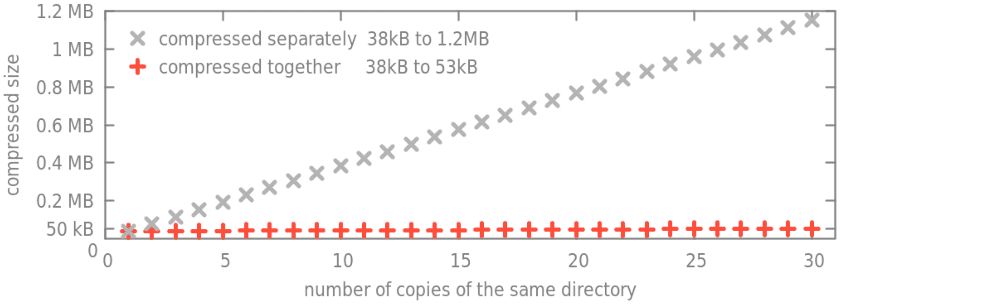
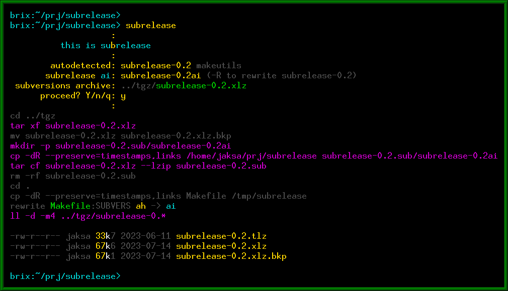
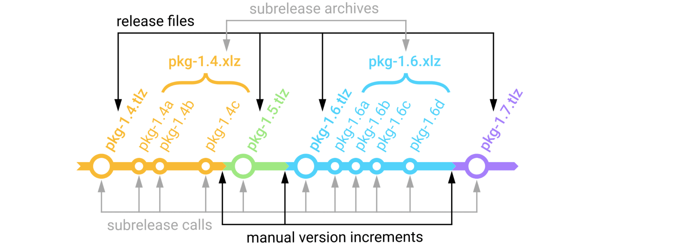
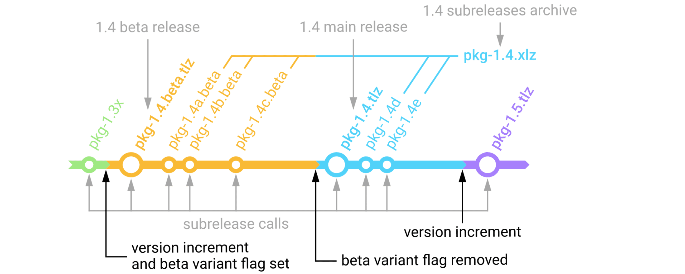
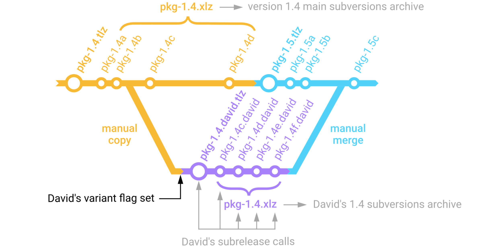

# subrelease

Simple tool to snapshot the current directory to the package file or into
subrelease archive.

#### Story

I have used a packing script since around 2000.  First, it was a few lines of shell
script, later a big one with html generator, and now small again.  I still use it
today, even alongside git.

The inspiration came when somebody told me that compressing a file once or
ten times is the same.

 <!--[](img/size.csv)-->

#### Usage

The hit-enter usage is: `subrelease`, `subrelease`, `subrelease`, increment version,
`subrelease`, `subrelease`...

This is a sequence of several 'small' subreleases which are handled
automatically, then a 'big' release, then the next round of subreleases, etc.  If it
is git, it would be a sequence of commits, then tag (plus release), and the next
round of commits.  When subrelease is used over the git repository, subreleases
are completely independent of the git.

Subrelease itself does:

1. identifies package name, version, subversion, and location of archive files (automatically),
2. identifies whether now it should be a subrelease or release (automatically),
3. saves package snapshot into an archive or a release file (automatically),
4. increments subrelease variable value if needed (automatically).

<!-- -->


#### Archive files

Subrelease saves two types of files:

&nbsp;&nbsp; **release files:**&nbsp; `.tlz` files containing just the package itself (saved after the version increment),  
&nbsp;&nbsp; **archive files:**&nbsp; `.xlz` files containing subrelease snapshots of a package between version increments.  

The `.tlz` and `.xlz` are shortcuts for `.tar.lz` and can be extracted with
standard tar.  Optionally, subrelease can save `.tar.gz`, `.tbz2`, `.tar.zst`,
etc.  All these files are saved into the parent directory, or the `../tgz` directory
if it exists.

Typical subrelease history and saved files would be:

<!-- -->


#### Variants

Subrelease can archive variants of a package, for instance, the "beta" variant,
or David's variant "david" etc.  To create a beta variant of the package, just set
the flag `VARIANT` to "beta" (when you increment a version).  Later when you
decide to turn off beta status, just remove the flag and call the subrelease.
You will have beta release and main release packages, and a common archive for
beta and main subreleases:

<!-- -->


Variant flags can be used to create temporary experimental variants of the package
to be eventually merged back later.  In the following example, we copy the
subversion b of the package to a different directory and set a variant flag on it.
Then on the next subrelease call, we got the local initial release of the variant
"david", and on the second call, a subversion archive is created and initiated
with a new subrelease c.  This subrelease c and the main package subrelease c are
different.  Archives are different as well, although having the same name.

<!-- -->


Archive names do not contain a variant string, to allow to freely change the variant
string from subversion to subversion.

#### Reserved names

To use the same version name by the subrelease and by the application,
subrelease has to understand variable definition in particular programming
language, and we have to reserve a few variable names, like this for C:

``` c
# define PACKAGE "package-name"
# define VERSION "1.13"
# define PROJECT "project-name"
# define AUTHORS "(c) Author1, Author2, 2023 GPLv3"
```

or for Perl:

``` perl
$PACKAGE="package-name";
$VERSION="1.13";
$PROJECT="project-name"; # comment
$COPYLEFT="(c) The.Author 1999, GPL";
```

Accompanying script `getversion` can inspect these reserved variables.  It
checks `VERSION.h` or `CONFIG.h` files, or `VERSION.pl`, `VERSION.py`, etc. for
other languages.  See [`getversion -h`](getversion.md) for a description of
the syntax for other languages.

For multi-language applications, the `Makefile` can be used to hold variables,
which when changed will write them to temporary files for every used language,
like `.version.pl`, `.version.py`, etc.

Reserved variable names are (plus a few more for config files):

&emsp; `PACKAGE` package name,  
&emsp; `VERSION` its version,  
&emsp; `SUBVERS` `SUBVERSION` subversion,  
&emsp; `PROJECT` project name,  
&emsp; `AUTHORS` `AUTHOR` `COPYLEFT` `COPYRIGHT` authors list, and notes,  
&emsp; `CAPTION` any package notes, message, definition,  
&emsp; `VARIANT` `BRANCH` variant/branch name.  

The `SUBVERSION` variable is automatically incremented always when the subversion
creates a new subrelease, thus the application can know which subversion it is.

#### Config files

Stealth operation without introducing any new variable definitions to the
source tree is possible by keeping them instead in the config file
`.subrelease` in the current or any parent directory (than you will not add
anything into the source tree).

Config files also recognize a few more variables.  To preserve the namespace of
application code these are config-files only, visible only in `.subrelease` or
`VERSION` files:

&emsp; `SUFFIX` the archive suffix, see [`subrelease -h`](subrelease.md) for the list of suffixes,  
&emsp; `TGZDIR` target directory, instead of the default `../tgz` or `..`,  
&emsp; `EXCLUDE` exclude specified files from being archived,  
&emsp; `ALWAYS` the script/command to be fired at the and of every `subrelease` run,  
&emsp; `ONREL` `ONRELEASE`  script only fired at full release,  
&emsp; `ONSUB` `ONSUBRELEASE`  only fired at the subrelease, not at release.  

Scripts can be used to automatically:

 * to sync data to mirror,
 * to submit a summary to a webpage,
 * to run code metrics scripts,
 * etc.

The `EXCLUDE` can be used to avoid `.git` subdirs in all project directories by
placing the `.subrelease` file in the top-level projects directory with a line:

```
EXCLUDE: .git
```

The `.subrelease` can be placed in the home directory, current directory, or any
parent directory.  The order of variables overriding is:

 1. `~/.subrelease` from the home directory,
 2. `./.subrelease` or `../.subrelease` or higher, variables here override these from 1.,
 3. CLI arguments, like `-v` option override config values, step 4. depends on its value,
 4. `./VERSION.c` or `./VERSION.pl` etc., these are main variables definitions, override 1. to 3.,
 5. CLI arguments, finally CLI again overrides everything.

Some variables can be defined in the `.subrelease` file and some in the `VERSION.c`
file etc. at the same time, to control their visibility.

#### See also

&nbsp;&nbsp; [subrelease -h](subrelease.md)  
&nbsp;&nbsp; [getversion -h](getversion.md)  

#### Installation

Files `subrelease` and `getversion` are standalone perl scripts, which can be
copied to any `/bin` directory for a system-wide installation.  For user-only
installation the `make install` routine is provided.

#### Under the hood

Subrelease is written in perl but is compiled from source files to the final
executable script by preprocessor.  The reason for such an approach is to have
a singlefile script as a result, and at the same time allow source code to be
structured to several files.  Perl provides the best expressive power and great
stability, which is (most) important for the maintenance of script in the long
term.  And for compactness of the executed application script.

Over time I had different requirements for the script.  Sometimes conflicting.
Today my subrelease design summary will be:

 * content-only approach without script's private metadata/database/indexes:
   - primary knowledge source - filenames in the archive,
   - secondary knowledge source - variables in the application source code (and configs),
 * data access with standard tools - `subrelease` is not needed to extract or inspect the archive,
 * autodetection first - autodetect everything possible to autodetect,
 * any-functionality = single-command:
   - `subrelease` to archive,
   - `getversion` to inspect,
 * can be used either as a standalone release tool or alongside git/github etc.

<br><div align=right><i>R.Jaksa 2023</i></div>
