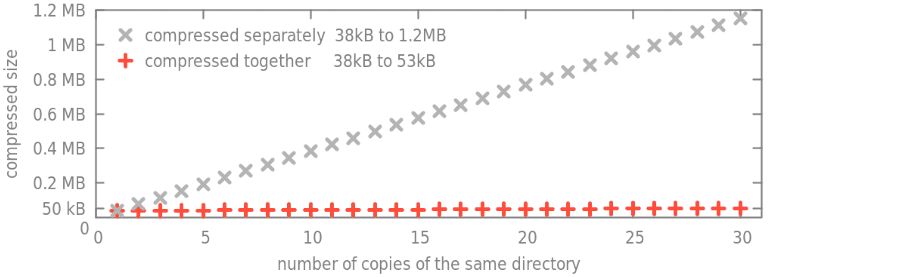
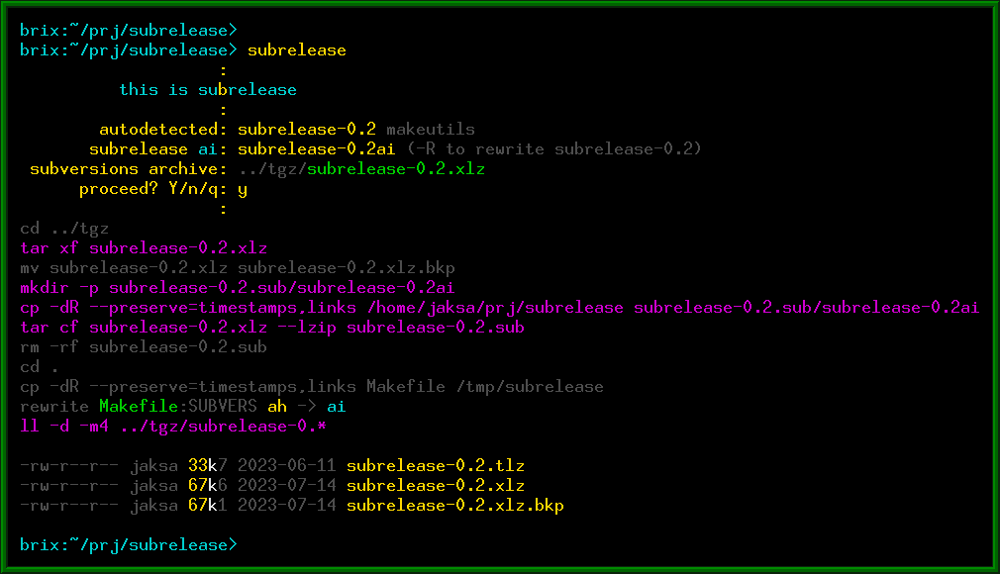
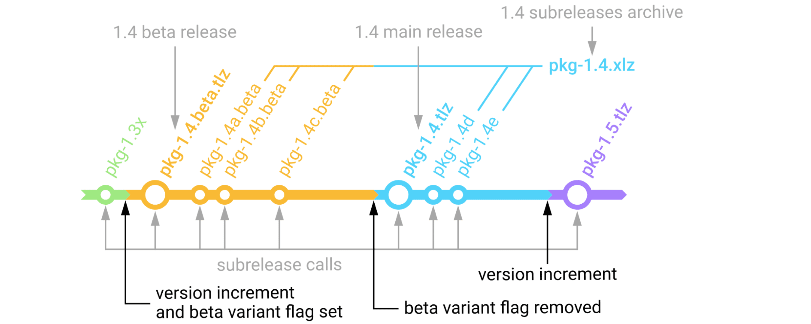
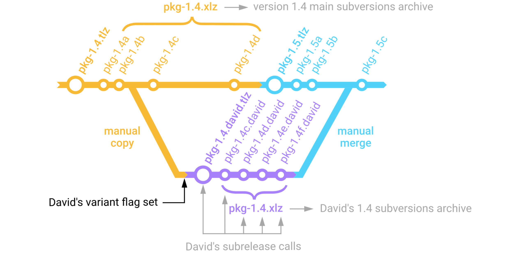

# subrelease

Simple tool to snapshot current directory to the package file or into
subrelease archive.

#### Story

I have used a packing script since around 2000.  First it was a few lines shell
script, later a big one with html generator, now small again.  I still use it
today, even alongside git.

The inspiration came when somebody told me that compressing a file once or
ten-times is the same.

 <!--[](doc/size.csv)-->

#### Usage

The hit-enter usage is: `subrelease`, `subrelease`, `subrelease`, increment version,
`subrelease`, `subrelease`...

This is a sequence of several 'small' subreleases which are handled
automatically, then a 'big' release, then next round of subreleases etc.  If it
is git, it would be a sequence of commits, then tag (plus release), and next
round of commits.  When subrelease is used over the git repository, subreleases
are completely independent from the git.

Subrelease itself does:

1. identifies package name, version, subversion and location of archive files (automatically),
2. identifies whether now it should be a subrelease or release (automatically),
3. saves package snapshot into archive or a release file (automatically),
4. increments subrelease variable value if needed (automatically).

<!-- -->


#### Archive files

Subrelease saves two types of files:

&nbsp;&nbsp; **release files:**&nbsp; `.tlz` files containing just the package itself (saved after the version increment),  
&nbsp;&nbsp; **archive files:**&nbsp; `.xlz` files containing subrelease snapshots of a package between version increments.  

The `.tlz` and `.xlz` are shortcuts for `.tar.lz` and can be extracted with
standard tar.  Optionally, subrelease can save `.tar.gz`, `.tbz2`, `.tar.zst`,
etc.  All these files are saved into parent directory, or into `../tgz` directory
if it exists.

Typical subrelease history and saved files would be:

<!-- -->


#### Variants

Subrelease can archive variants of a package, for instance the "beta" variant,
or David's variant "david" etc.  To create a beta variant of package, just set
a flag `VARIANT` to "beta" (when you increment a version).  Later when you
decide to turn off beta status, just remove the flag and call the subrelease.
You will have beta release and main release packages, and a common archive for
beta and main subreleases:

<!-- -->


Variants flags can be used to create temporary experimental variants of package
to be eventually merged-back later.  In following example we copy the
subversion b of package to different directory and set a variant flag on it.
Then on the next subrelease call we got local initial release of variant
"david", and on the second call a subversions archive is created and initiated
with a new subrelease c.  This subrelease c and the main package subrelease c are
different.  Archives are different as well, although having the same name.

<!-- -->


Archive names do not contain variant string, to allow to freely change variant
string from subversion to subversion.

#### Reserved names

In order to use the same version name by the subrelease and by the application,
subrelease has to understand variable definition in particular programming
language, and we have to reserve few variable names, like this for C:

``` c
# define PACKAGE "package-name"
# define VERSION "1.13"
# define PROJECT "project-name"
# define AUTHORS "(c) Author1, Author2, 2023 GPLv3"
```

or for Perl:

``` perl
$PACKAGE="package-name";
$VERSION="1.13";
$PROJECT="project-name"; # comment
$COPYLEFT="(c) The.Author 1999, GPL";
```

Accompanying script `getversion` can inspect these reserved variables.  It
checks `VERSION.h` or `CONFIG.h` files, or `VERSION.pl`, `VERSION.py`, etc. for
other languages.  See [`getversion -h`](doc/getversion.md) for description of
syntax for other languages.

For multi-language applications, the `Makefile` can be used to hold variables,
which when changed will write them to temporary files for every used language,
like `.version.pl`, `.version.py`, etc.

Reserved variables names are (plus few more for config files):

&emsp; `PACKAGE` package name,  
&emsp; `VERSION` its version,  
&emsp; `SUBVERS` `SUBVERSION` subversion,  
&emsp; `PROJECT` project name,  
&emsp; `AUTHORS` `AUTHOR` `COPYLEFT` `COPYRIGHT` authors list, and notes,  
&emsp; `CAPTION` any package notes, message, definition,  
&emsp; `VARIANT` `BRANCH` variant/branch name.  

The `SUBVERSION` variable is automatically incremented always when subversion
creates a new subrelease, thus the application can know which subversion it is.

#### Config files

Stealth operation without introducing any new variables definitions to the
source tree is possible by keeping them instead in the config file
`.subrelease` in current or any parent directory (than you will not add
anything into source tree).

Config files also recognize few more variables.  To preserve the namespace of
application code these are config-files only, visible only in `.subrelease` or
`VERSION` files:

&emsp; `SUFFIX` the archive suffix, see [`subrelease -h`](doc/subrelease.md) for the list of suffixes,  
&emsp; `TGZDIR` target directory, instead of the default `../tgz` or `..`,  
&emsp; `ALWAYS` the script/command to be fired at the and of every `subrelease` run,  
&emsp; `ONREL` `ONRELEASE`  script only fired at full release,  
&emsp; `ONSUB` `ONSUBRELEASE`  only fired at the subrelease, not at release.  

Scripts can be used to automatically:

 * to sync data to mirror,
 * to submit summary to webpage,
 * to run code metrics scripts,
 * etc.

The `.subrelease` can be found in home directory, current directory or any
parent directory.  The order of variables overriding is:

 1. `~/.subrelease` from home directory,
 2. `./.subrelease` or `../.subrelease` or higher, varibles here override these from 1.,
 3. CLI arguments, like `-v` option overrides config values, step 4. depends on its value,
 4. `./VERSION.c` or `./VERSION.pl` etc., these are main variables definitions, override 1. to 3.,
 5. CLI arguments, finaly CLI again overrides everything.

Some variables can be defined is `.subrelease` file and some in `VERSION.c`
file etc. at the same time, to control their visibility.

#### See also

&nbsp;&nbsp; [subrelease -h](doc/subrelease.md)  
&nbsp;&nbsp; [getversion -h](doc/getversion.md)  

#### Installation

Files `subrelease` and `getversion` are standalone perl scripts, which can be
copied to any `/bin` directory for a system-wide installation.  For user-only
installation the `make install` routine is provided.

#### Under the hood

Subrelease is written in perl, but is compiled from source files to the final
executable script by preprocessor.  The reason for such approach is to have
singlefile script as a result, and at the same time allow source code to be
structured to several files.  Perl provides best expressive power and great
stability, which is (most) important for the maintenance of script in the long
term.  And for compactness of executed application script.

Over the time I had different requirements for the script.  Sometimes conflicting.
Today my subrelease design summary would be:

 * content-only approach without script's private metadata/database/indexes:
   - primary knowledge source - filenames in the archive,
   - secondary knowledge source - variables in the application source code (and configs),
 * data access with standard tools - `subrelease` is not needed to extract or inspect the archive,
 * autodetection first - autodetect everything what is possible to autodetect,
 * any-functionality = single-command:
   - `subrelease` to archive,
   - `getversion` to inspect,
 * can be used either as standalone release tool, or alongside git/github etc.

<br><div align=right><i>R.Jaksa 2023</i></div>
